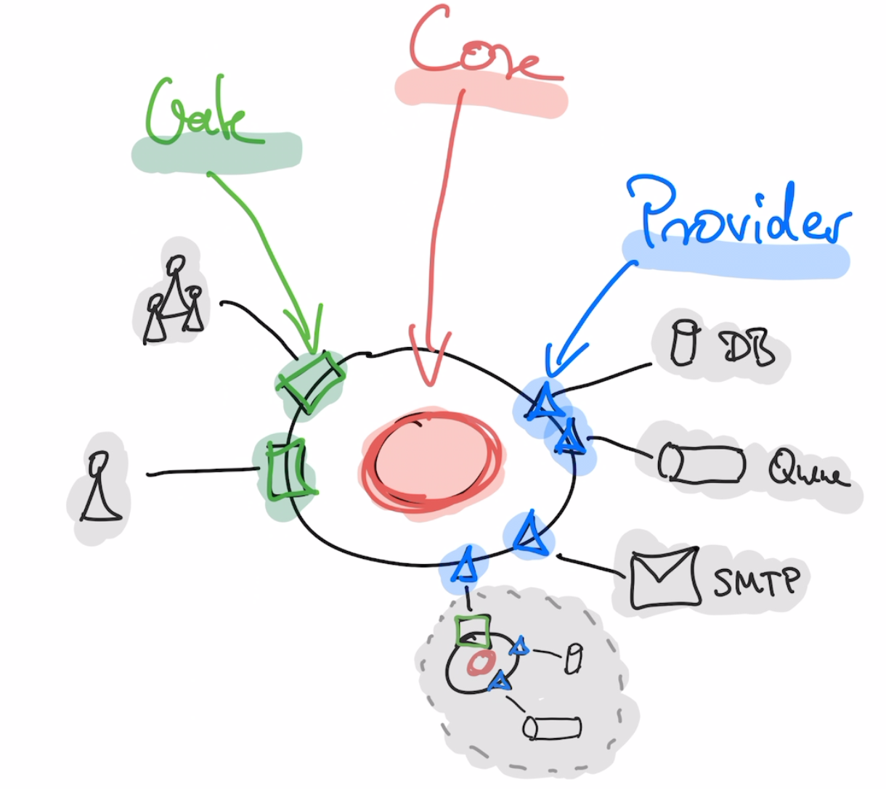
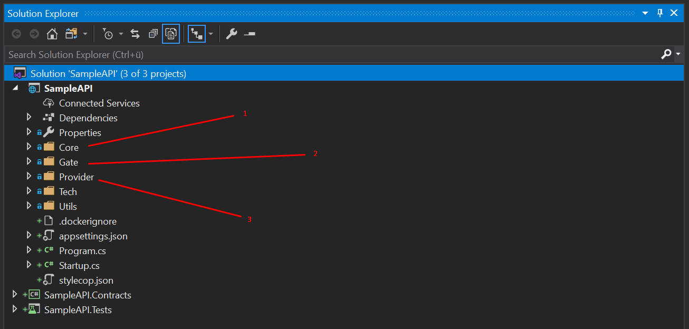
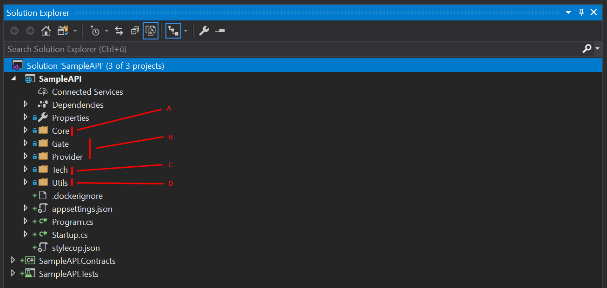
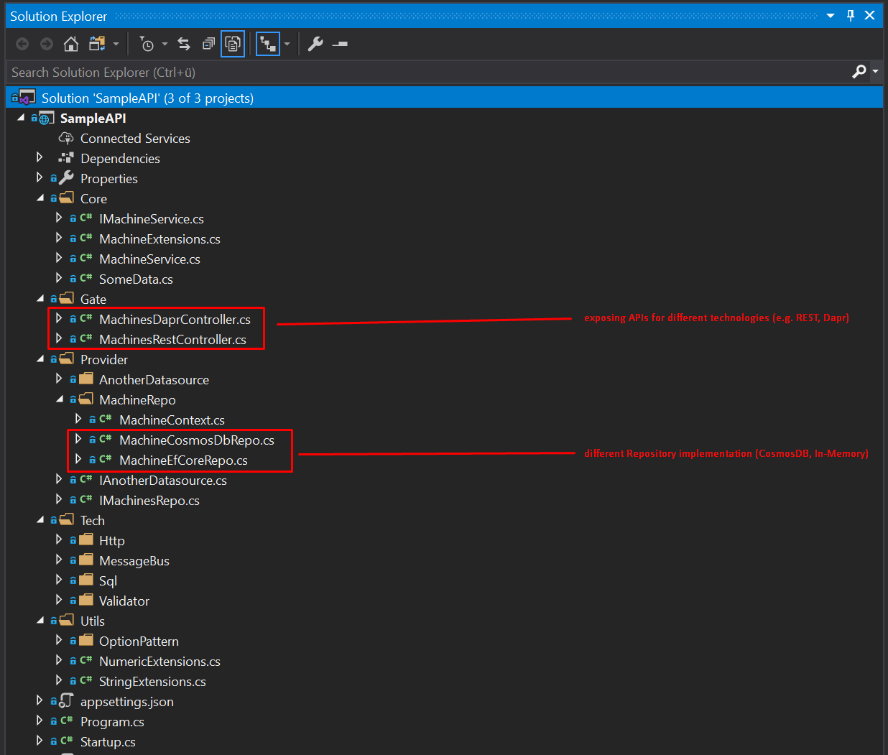
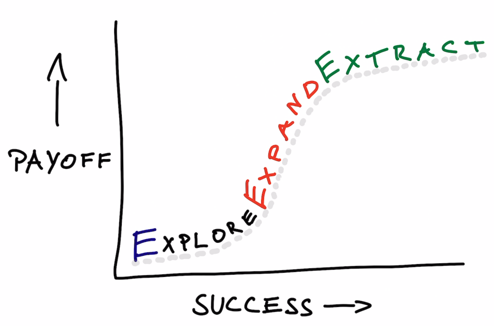

# Sample C# Project

## Key Architecture Goals & Principles

- Simple Ruleset
- Clear Separation of Concerns
- Supports an Evolutionary Approach
- Supports Encapsulated Modules (see [Testing is a first class citizen](#Testing-is-a-first-class-citizen))

This can be achieved by following these concepts:

* [Software Cell](#Software-Cell)
* [Contracts](Contracts)
* [Fractal Design](#Fractal-Design)
* [3X Model](#3X-Model)
* [Code Classifications](#Code-Classifications)

# C# Project Structure

## High Level Project Structure

The default C# solution consists of three C# projects:
* SampleAPI - the regular code lives here
* SampleAPI.Contracts - the place where to put external model definitions
* SampleAPI.Tests - put tests in here

## Project Folder Structure

**Cell Structure**

* 1: Core - contains the pure business logic and rules
* 2: Gate - this is the entry point for external calls (controllers, EventHandlers, ...)
* 3: Provider - encapsulates knowledge and communication with external systems

[read more](#Software-Cell)

**Code Classifications**

* A: **business** code
* B: **custom tailored** code (business + technology mixed)
* C: **retail** code (pure technology, common libraries, e.g. MongoDB, RabbitMQ, ...)
* D: **neutral** code (pure technology, small snippets/extensions, almost no dependencies)

[read more](#Code-Classifications)

### SampleAPI Example

# Software Cell

## Gate

* add gate symbol (rectangle)

External actors trigger activities through a Gate. This folder can contain Controllers, EventHandlers, CLIs etc.

- Gates ensure schematically correct input data and transform and call the Core functionality.
- Gates don't implement business code.
- Testing a Gates behavior in isolation should not depend on mocked providers, only on mocked core services

TODO: Show SampleAPI Gate stuff
* screenshots: Call interface from Core
* different controllers use the same business logic from the core

## Core

* add core symbol (cell)

Contains the pure business logic and rules. Is called by Gates and calls Providers.

- Has no knowledge of persistence or transport technologies.
- Ensures business rules, not technical (i.e. persitence) rules.
- Exposes Interfaces for Gates to use and for mocking in test scenarios
- Should be the dominant force in the system -> Contracts, Gates and Providers adapt to the business needs and use DTOs and objects from the Core
 
TODO: Show SampleAPI Core stuff
* call providers

## Provider

* add provider symbol (triangle)

Encapsulates knowledge of persistence or transport technologies and communicates with external systems

- Exposes Interfaces expected by the Core, but holds the Interfaces itself in order to reduce confusion.
- Maps to Core DTOs and objects
- Acts as Anti-Corruption layer and spilling zone for nasty technical transformations
TODO: Show SampleAPI Provider stuff

## Summary

A software cell can be devided into two parts: core + membrane

The membrane acts as a spill zone or an anti-corruption layer to guarantee modular components that are testable.

External contracts make sure that all agreements between services are explicit. This allows versioning and guarantees type safety.

## REmove

TODO: Show evolutionary paths and optional Folders areas

This is achieved by separating a service in four key areas, named **Contract**, **Gate**, **Core** and **Provider**

TODO: Show circular diagram and introduce concepts shortly by their concers
TODO: Show SampleAPI Folder structure and link to Repo

# Contract

TODO: describe contract like the other 
TODO: Show SampleAPI contract stuff

**What is the benefit of creating a separate `Contracts` project?**

> 

Soft Contracts or Hard Contracts - You decide!
Across projects we suggest hard contracts. 

# Fractal Design

TODO

# 3X Model

**Kent Beck**

As an idea/product/company grows, value-maximizing behavior changes dramatically:

* **Explore** — to overcome disinterest, try many small experiments.
* **Expand** — to overcome bottlenecks to scaling, ease the limitations of the next rate-limiting resource.
* **Extract** — to sustain growth, continually increase profitability while you finish growing.

# Code Classifications

## Core
* may include Contracts (optional)
* implements usecases (business logic, business validation, business usecases)
* defines domain-objects
* uses providers to access external resources (with the outside world)

## Gate
* incomming requests (e.g. controllers)
* membrane for the core: validates contract schema, maps to core domain-object 
* includes: Contract, core.domain-object

## Provider
* handles external communication on behalf of the core
* membrane for the core: validates contract schema, maps from/to domain-object
* provides interfaces for the core to consume (america first approach, provider second) 
* includes Contract, includes domain-object

## Tech
* cross cutting concerns, common technical implementations specific to the technology landscape of the project (may have strong project specific conventions)
* middlewares, technical libraries fine-tuned for this technical landscape
* mainly focused on technical aspects (like DB, MessageQueues, etc) but may also carry specific elements from the business domain (http middleware conventions)

## Utils
* completly neutral, no cross-dependencies to internal projects, blood type 0, could be useful for everybody in the world

# Testing is a first class citizen

Questions:

* How important are tests in your project?
* What types of tests are most important?

Answer:

* It depends! :-)
	* What is your position on the 3X curve?
	* What are your quality constraints? (budget, deadlines, scope)
	* ...

