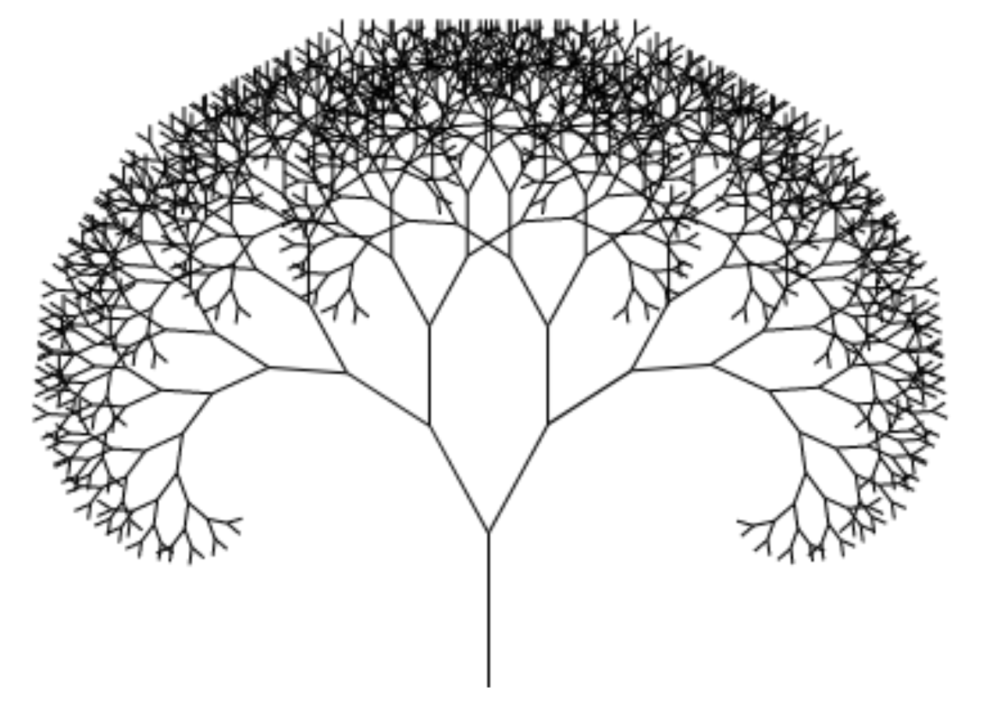

# Sample C# Project

## Key Architecture Goals & Principles

- Simple Ruleset
- Clear Separation of Concerns
- Supports an Evolutionary Approach
- Supports Encapsulated Modules (see [Testing is a first class citizen](#Testing-is-a-first-class-citizen))

This can be achieved by following these concepts:

* [Software Cell](#Software-Cell)
* [Contracts](Contracts)
* [Fractal Design](#Fractal-Design)
* [3X Model](#3X-Model)
* [Code Classifications](#Code-Classifications)

# C# Project Structure

## High Level Project Structure

The default C# solution consists of three C# projects:
* **SampleAPI** - the regular code lives here
* **SampleAPI.Contracts** - the place where to put external model definitions
* **SampleAPI.Tests** - put tests in here

## Project Folder Structure

**Cell Structure**

* 1: **Core** - contains the pure business logic and rules
* 2: **Gate** - this is the entry point for external calls (controllers, EventHandlers, ...)
* 3: **Provider** - encapsulates knowledge and communication with external systems

[read more](#Software-Cell)

**Code Classifications**

* A: **business** code
* B: **custom tailored** code (business + technology mixed)
* C: **retail** code (pure technology, common libraries, e.g. MongoDB, RabbitMQ, ...)
* D: **neutral** code (pure technology, small snippets/extensions, almost no dependencies)

[read more](#Code-Classifications)

### SampleAPI Example

# Software Cell

## Gate

External actors trigger activities through a Gate. This folder can contain Controllers, EventHandlers, CLIs etc.

- Gates ensure schematically correct input data and transform and call the Core functionality.
- Gates don't implement business code.
- Testing a Gates behavior in isolation should not depend on mocked providers, only on mocked core services

## Core

Contains the pure business logic and rules. Is called by Gates and calls Providers.

- Has no knowledge of persistence or transport technologies.
- Ensures business rules, not technical (i.e. persitence) rules.
- Exposes Interfaces for Gates to use and for mocking in test scenarios
- Should be the dominant force in the system -> Contracts, Gates and Providers adapt to the business needs and use DTOs and objects from the Core

## Provider

Encapsulates knowledge of persistence or transport technologies and communicates with external systems

- Exposes Interfaces expected by the Core, but holds the Interfaces itself in order to reduce confusion.
- Maps to Core DTOs and objects
- Acts as Anti-Corruption layer and spilling zone for nasty technical transformations

## Summary

A software cell can be devided into two parts: core + membrane

The membrane acts as a spill zone or an anti-corruption layer to guarantee modular components that are testable.

External contracts make sure that all agreements between services are explicit. This allows versioning and guarantees type safety.

# Contract

**The Concept of "notarization" Applied to Software**

By putting data definitions of external API endpoints (e.g. Controllers) into a separate *contracts* project, these definitions are clearly separated and stripped from any business code and are explicit to any outside party.

It is like an agreement beteween two parties, whereas the *contracts* project plays the role of a notary, witnessing agreements between both parties.

There are two types of contracts:
* explicit contracts - managed by a third party
* implicit contracts - API endpoints may not have a documented interface and parties may not be fully aware 

**Original Definition**

A notary is a person authorised to perform acts in legal affairs, in particular witnessing signatures on documents.

Documents are notarized to deter fraud and to ensure they are properly executed. An impartial witness (the notary) identifies signers and makes sure they have entered into agreements knowingly and willingly. Loan documents including deeds, affidavits, contracts, powers of attorney are very common documents needing notarization.

# Fractal Design

Fractals exhibit similar patterns at increasingly small scales called self similarity, also known as expanding symmetry or unfolding symmetry.

A Fractal is a geometrical figure, each part of which has the same statistical character as the whole. They are useful in modelling structures (such as snowflakes) in which similar patterns recur at progressively smaller scales, and in describing partly random or chaotic phenomena such as crystal growth and galaxy formation.

# 3X Model

**Kent Beck**

As an idea/product/company grows, value-maximizing behavior changes dramatically:

* **Explore** — to overcome disinterest, try many small experiments.
* **Expand** — to overcome bottlenecks to scaling, ease the limitations of the next rate-limiting resource.
* **Extract** — to sustain growth, continually increase profitability while you finish growing.

# Code Classifications

* A: business code
* B: technology code
* C: mixed code (business + technology)
* C: neutral code 

**business code**
* pure business logic and rules

**technology code**
* pure technology code, like open source libraries (MongoDB, RabbitMQ, ...)
* do not carry specific knowledge from the business domain
* common code that focuses on technical aspects and has abstractions that are useful for many scenarios
* like a **retail** product (suitable for the masses)
 
**mixed code**
* business code and technology code mixed
* is focused on technical aspects (like DB, MessageQueues, Middlewares, etc) but carries specific knowledge from the business domain (http middleware conventions, validation rules, etc)
* this code could be compared to a **tailored** solution (cannot be easily shared with other projects, because it is so specific to the usecase)

**neutral code**
* completly neutral, no cross-dependencies to other projects
* can be easily included and is ready to be used without much configuration

# Testing is a first class citizen

Questions:

* How important are tests in your project?
* What types of tests are most important?

Answer:

* It depends! :-)
	* What is your position on the 3X curve?
	* What are your quality constraints? (budget, deadlines, scope)
	* ...

